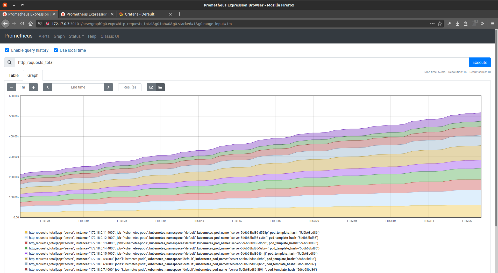
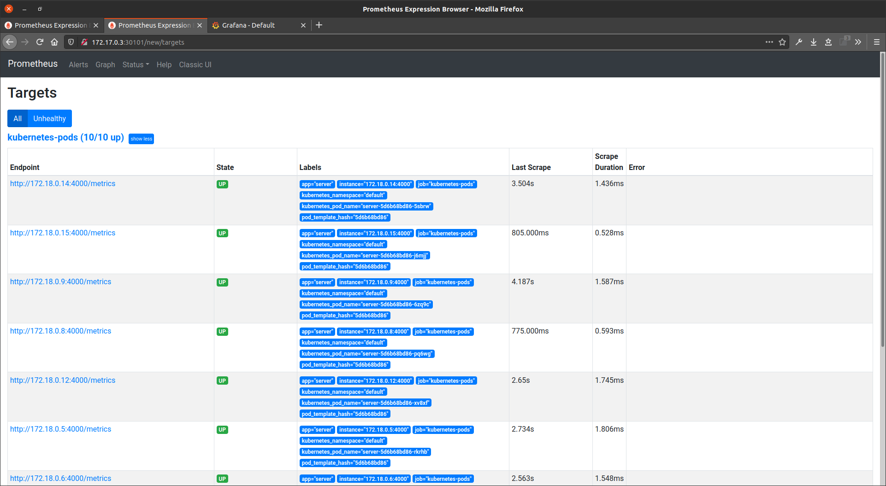
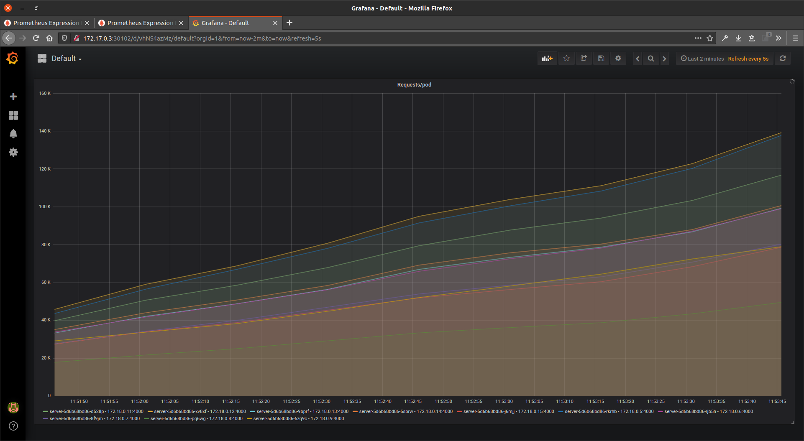

# POC: Monitoring in Kubernetes

It demonstrates how to use [Prometheus](https://github.com/prometheus/prometheus) and [Grafana](https://github.com/grafana/grafana) for monitoring [Node.js](https://github.com/nodejs/node) servers running on [Docker](https://github.com/docker) containers provisioned by [Kubernetes](https://kubernetes.io/).

We want to display in a dashboard the number of requests made to each Kubernetes pod running a server.

## How to run

### Server

| Description | Command |
| :--- | :--- |
| Bake Docker image | `make server-build` |
| Provision | `make server-up` |
| Destroy | `make server-down` |
| Show logs | `make server-logs` |
| Run tests | `make server-test` |

> Running `SCALE=N make server-scale` will run N pods (e.g.: `SCALE=10 make server-scale` will run 10 pods)

### Prometheus and Grafana

| Description | Command |
| :--- | :--- |
| Provision | `make monitoring-up` |
| Destroy | `make monitoring-down` |

> Running `./scripts/setup-grafana.sh grafana import` will create the data source

## Preview

